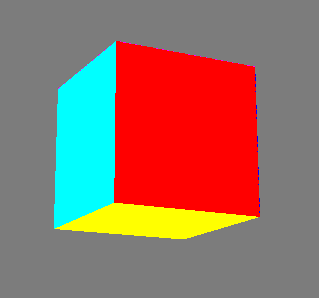

# **Vulkan Steps**

## **Introduction**

Vulkan can be long to learn, and getting a first outcome can be very slow. The purpose here is not to make a propper tutorial, but more to provide the different steps to build a basic Vulkan application. In fact, there are multiple goals. The first one, is to have a quick access to the code required for a given part, but also teaching Vulkan the hard way : through the [specification](https://registry.khronos.org/vulkan/specs/1.3-extensions/html/index.html).

Unfortunately, it seems that if we are not provided at least with the steps required to build a renderer, it is kinda hard (if not impossible) to know what to look for in the [specification](https://registry.khronos.org/vulkan/specs/1.3-extensions/html/index.html). Thus, the table of content that I provide is very important as it is the first step towards learning Vulkan. Indeed, personnaly to learn Vulkan, I looked at the table of content of the tutorial from [LunarG](https://vulkan.lunarg.com/doc/view/1.2.154.1/windows/tutorial/html/index.html) and tried, only by looking at the title, to find the corresponding part into the [specification](https://registry.khronos.org/vulkan/specs/1.3-extensions/html/index.html) and try to implement it without looking. It was an exercise for me to force myself into looking at the [specification](https://registry.khronos.org/vulkan/specs/1.3-extensions/html/index.html) and the using the content of the tutorial as a correction.

Each step of the tutorial, but the 0, will be composed of three parts:
 - Its title which refer directly to a part of the [specification](https://registry.khronos.org/vulkan/specs/1.3-extensions/html/index.html) when possible (the chapter is given between brackets).
 - The final function called in this step. Most of the steps are build following the same scheme: some structures to fill before passing them to a function. Thus, by having the name of the final function, or some functions if the step is too tricky, it is possible to deduce the structures to create and the other functions to call by reading the [specification](https://registry.khronos.org/vulkan/specs/1.3-extensions/html/index.html).
 - The code of the step.

 I like to see this approach as multiplie exercices. The goal of each exercise is expressed by the title. Then, if stuck, some hints are given to tell what to look for in the [specification](https://registry.khronos.org/vulkan/specs/1.3-extensions/html/index.html). Finally, the correction of the exercise (the code).

If it is not already done, [click here to open the Vulkan specification](https://registry.khronos.org/vulkan/specs/1.3-extensions/html/index.html).

The main source of information that helped me build a first Vulkan application where:
 - [LunarG](https://vulkan.lunarg.com/doc/view/1.2.154.1/windows/tutorial/html/index.html)
 - [Vulkan Tutorial](https://vulkan-tutorial.com/)
 - [The Vulkan Specification](https://registry.khronos.org/vulkan/specs/1.3-extensions/html/index.html), of course.

Our goal is to draw a cube made during a rendering loop (like in video games), thus all the steps are build toward this goal. It is just a simple exemple with a shader that takes as input as shader storage buffer and add for each value the id of the thread being executed before storing it in an output shader storage buffer. 

In a second part, we are going to code a compute pipeline. The goal is to run a compute shader followed by the rendering.

### **Disclaimer**
This is not a tutorial to teach rendering, having a background in others graphic API such as OpenGL is almost mendatory. I will not go in depth on why we do that or that. There are already good tutorial for this such as the [Vulkan Tutorial](https://vulkan-tutorial.com/).

The code that I provide is not the cleanest, and this is done on purpose. Why? Because I did not wanted to build functions so that the reader can follow the tutorial linearly (copy / paste every step one after the other). Of course, the reader is encourage to build his own functions, classes and whatever he wants.

## **Table of contents**

### Graphic Pipeline

 - [Environment configuration](Tutorial/environment_configuration.md)
 - [Shader files](Tutorial/shader_files.md)
 - [Step 0: Window creation with GLFW](Tutorial/context_initialisation_with_GLFW.md)
 - [Step 1: Instances (4.2.)](Tutorial/instance.md)
 - [Step 2: Surfaces](Tutorial/surface.md)
 - [Step 3: Devices and Queues (5.)](Tutorial/devices_and_queues.md)
    - [Step 3.1: Physical Devices (5.1.)](Tutorial/physical_devices.md)
    - [Step 3.2: Logical Devices and Queues (5.2. and 5.3.)](Tutorial/logical_devices_and_queues.md)
 - [Step 4: Command Buffers (6.)](Tutorial/command_buffers.md)
 - [Step 5: Swapchain and Image Views](Tutorial/swapchain_and_image_views.md)
    - [Step 5.1: Swapchain (33.10.)](Tutorial/swapchain.md)
    - [Step 5.2: Image Views (12.5.)](Tutorial/image_views.md)
 - [Step 6: Depth Buffer (12.3., 12.5. and 12.7.)](Tutorial/depth_buffer.md)
 - [Step 7: Uniform Buffer (12.1. and 12.7.)](Tutorial/uniform_buffer.md)
 - [Step 8: Descriptor Sets (14.2.)](Tutorial/descriptor_sets.md)
    - [Step 8.1: Descriptor Set Layout (14.2.1.)](Tutorial/descriptor_set_layout.md)
    - [Step 8.2: Pipeline Layouts (14.2.2.)](Tutorial/pipeline_layouts.md)
    - [Step 8.3: Allocation of Descriptor Sets (14.2.3.)](Tutorial/allocation_of_descriptor_sets.md)
    - [Step 8.4: Descriptor Set Updates (14.2.4.)](Tutorial/descriptor_set_updates.md)
 - [Step 9: Render Pass (8.1.)](Tutorial/render_pass.md)
 - [Step 10: Shader](Tutorial/shader.md)
    - [Step 10.1: Compiling and reading shaders](Tutorial/compiling_and_reading_shaders.md)
    - [Step 10.2: Shader Modules (9.1)](Tutorial/shader_modules.md)
 - [Step 11: Framebuffers (8.3.)](Tutorial/framebuffers.md)
 - [Step 12: Vertex Buffers (12.1. and 12.7.)](Tutorial/vertex_buffers.md)
    - [Step 12.1: Data](Tutorial/data.md)
    - [Step 12.2: Coordinate and Color Buffers (12.1 and 12.7)](Tutorial/coordinate_and_color_buffers.md)
 - [Step 13: Graphics Pipelines (10.2.)](Tutorial/graphics_pipelines.md)
 - [Step 14: Fences and Semaphores (7.3. and 7.4.)](Tutorial/fences_and_semaphores.md)
    - [Step 14.1: Fences (7.3.)](Tutorial/fences.md)
    - [Step 14.2: Semaphores (7.4)](Tutorial/semaphores.md)
 - [Step 15: Drawing (21.3. and 33.10.)](Tutorial/drawing.md)

### Compute Pipeline
 - [Comp 0: Introduction](Tutorial/compute/comp0_intro.md)
 - [Comp 1: Compute Queue (5.3)](Tutorial/compute/comp1_compute_queue.md)
 - [Comp 2: Compute Shader](Tutorial/compute/comp2_compute_shader.md)
   - [Comp 2.1: Compiling and reading shaders](Tutorial/comp2_1_compiling_and_reading_shaders.md)
   - [Comp 2.2: Shader Module](Tutorial/comp2_2_compiling_and_reading_shaders.md)
 - [Comp 3: Descriptor Sets](Tutorial/compute/comp3_descriptor_sets.md)
   - [Comp 3.1: Descriptor Set Layout](Tutorial/compute/comp3_1_descriptor_set_layout.md)
   - [Comp 3.2: Pipeline Layouts](Tutorial/compute/comp3_2_pipeline_layouts.md)
   - [Comp 3.3: Allocation of Descriptor Sets](Tutorial/compute/comp3_3_allocation_of_descriptor_sets.md)
   - [Comp 3.4: Descriptor Set Updates](Tutorial/compute/comp3_4_descriptor_set_updates.md)
 - [Comp 4: Compute Pipeline](Tutorial/compute/comp4_compute_pipeline.md)
 - [Comp 5: Fences and Semaphores](Tutorial/compute/comp5_fences_and_semaphores.md)
   - [Comp 5.1: Fences](Tutorial/compute/comp5_1_fences.md)
   - [Comp 5.2: Semaphores](Tutorial/compute/comp5_2_semaphores.md)
 - [Comp 6: Dispatch](Tutorial/compute/comp6_dispatch.md)
 - [Comp 7: Drawing](Tutorial/compute/comp7_drawing.md)